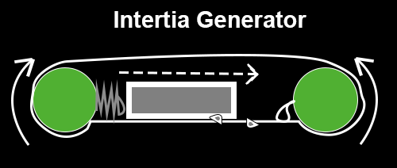

# Space Propulsion

* [Intertia Generator](physics/inertia.md)
* [Chain Reaction](physics/chain.md)
* [Steam Engine](physics/steamengine.md)

# Artificial Intelligence Processors

* [Trinary Processor](processor/TrinaryProcessor.md)

# Sound

* [Aurial Capture Preventer](sound/AurialCapturePreventer.md)
* [Tone Generator](sound/GenSound.hpp)

# Extras

* [Golf Swing](physics/golf.md)
